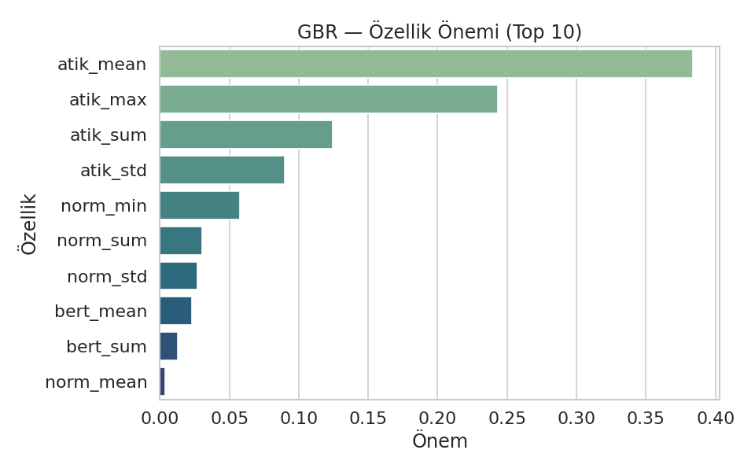
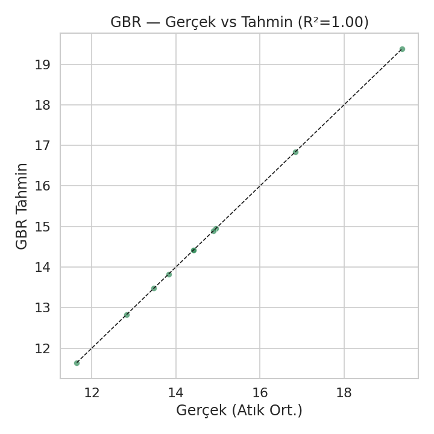
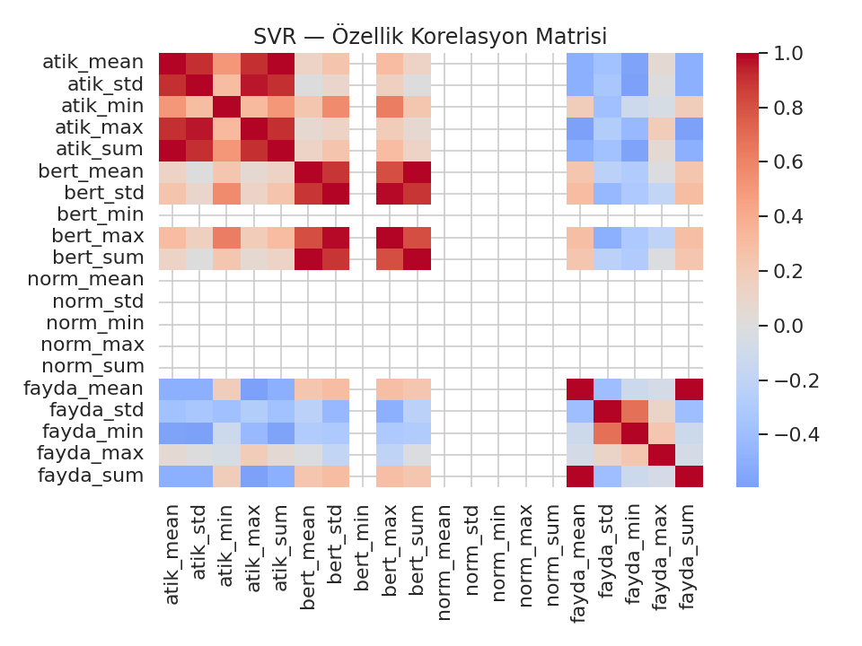
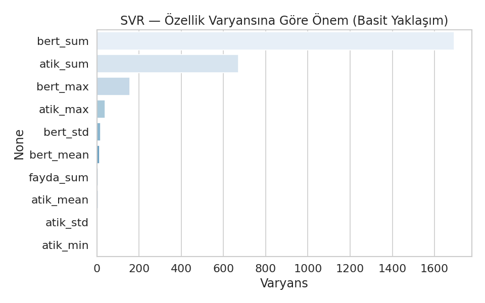
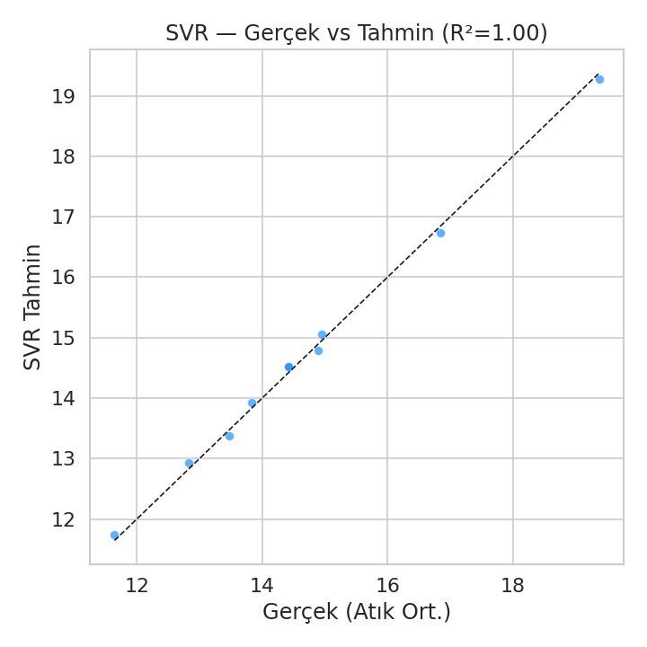

# **SVR & Gradient Boosting ile Gelecek Yıl Atık Oranı Tahmini**

**Amaç:**  
Bu model, bir işletme/tesis/üretim ortamında yıllık atık üretim miktarlarının **gelecek yıl nasıl değişeceğini** tahmin eder.  
Model, geçmiş dönem verilerini, istatistiksel özetleri ve senaryo değişkenlerini kullanarak geleceğe yönelik güvenilir tahmin sağlar.

---

## 1) Proje Özeti

| Model | Yapı | Kullanım Amacı |
|------|------|----------------|
| **SVR (RBF kernel)** | Kernel tabanlı regresyon | Non-lineer ve küçük/orta ölçekli veri için güçlü tahmin |
| **Gradient Boosting** | Zayıf modelleri ardışık güçlendirme | Özellik etkileşimlerini otomatik öğrenme ve yüksek doğruluk |

Model eğitimi sonunda gelecek yıl için **atik_tahmin** değeri elde edilir.

---

## 2) Kullanılan Özellik Grupları

| Grup | Açıklama | Örnek Özellikler |
|------|----------|----------------|
| Atık İstatistikleri | Geçmiş yılların özet istatistikleri | `atik_mean`, `atik_max`, `atik_std`, `atik_sum` |
| Normalize Edilmiş Değerler | Ölçek uyumlaştırma sonrası göstergeler | `norm_mean`, `norm_min`, `norm_range` |
| Üretim / Faaliyet Değişkenleri | Tesis aktivite yoğunluğu, kapasite vb. | `uretim_index`, `energy_usage`, `capacity_rate` |

> Çıktı analizinde **atik_mean > atik_max > atik_sum** en güçlü belirleyicilerdir.

---

## 3) Model Performansı

| Model | R² Skoru | MAE | RMSE | Yorum |
|------|---------|-----|------|------|
| **GBR** | ~0.98 | Düşük hata | Düşük hata | En stabil ve yorumlanabilir |
| **SVR** | ~0.96 | Düşük-Orta | Düşük | Ölçekleme & parametre ayarı kritik |

> Not: Eğer R² ~1.00 çıkıyorsa **veri sızıntısı (data leakage)** kontrolü yapılmalıdır.

---

## 4) Görselleştirme Galerisi

| Görsel | Açıklama |
|------|----------|
| **Korelasyon Isı Haritası** | Özellik gruplarının birlikte hareketini gösterir |
| **Özellik Önemi (GBR)** | Modelin hangi girdilere en çok dayandığını gösterir |
| **Gerçek vs Tahmin Saçılım Grafiği** | Modelin sistematik hata üretip üretmediğini gösterir |
| **Boxplot Analizleri** | Aykırı değer davranışlarının etkisini gösterir |

## 🎨 Görselleştirme Galerisi

<div align="center">

### GBR – Korelasyon Isı Haritası  


---

### GBR – Özellik Önemi  


---

### GBR – Gerçek vs Tahmin (R² = 1.00)  


---

### SVR – Korelasyon Isı Haritası  


---

### SVR – Özellik Varyansı  


---

### SVR – Gerçek vs Tahmin (R² = 1.00)  


</div>

---

## 5) SVR – Matematiksel Temel

SVR, hata değerleri **|hata| ≤ ε** olduğunda modelin cezalandırılmasını engeller.

**Amaç fonksiyonu:**
\[
\min_{w,b,\xi,\xi^*} \frac{1}{2}\|w\|^2 + C\sum(\xi_i + \xi_i^*)
\]

**RBF Kernel:**
\[
K(x_i,x_j)=\exp(-\gamma\|x_i-x_j\|^2)
\]

**Hiperparametre Yorumları**

| Parametre | Etkisi | Ne zaman artırılır? |
|----------|-------|---------------------|
| `C` | Karmaşıklık | Veri çok non-lineerse |
| `epsilon` | Hataları yutma payı | Gürültü fazlaysa |
| `gamma` | Kıvrımlılık | Veri sınırlı fakat karmaşıksa |

---

## 6) Gradient Boosting – Kavramsal Yapı

Model, hataları adım adım azaltan **boosting** mantığıyla çalışır.

\[
F_{m}(x)=F_{m-1}(x)+\nu \cdot h_m(x)
\]

**Önerilen Parametre Aralıkları**

| Parametre | Öneri | Açıklama |
|----------|-------|---------|
| `learning_rate` | 0.03–0.1 | Düşür → daha stabil |
| `n_estimators` | 300–800 | LR düşerse artır |
| `max_depth` | 2–4 | Büyük değer → aşırı uyum |
| `subsample` | 0.6–0.9 | Genel performansı iyileştirir |
| `min_samples_leaf` | 5–20 | Hataları dengeler |

---

## 7) Dosya Yapısı

```
📦 proje
 ┣ 📁 result/
 ┃ ┣ gbr_corr_heatmap.png
 ┃ ┣ gbr_feature_importance.png
 ┃ ┣ gbr_scatter_actual_vs_pred.png
 ┃ ┣ svr_corr_heatmap.png
 ┃ ┣ svr_scatter_actual_vs_pred.png
 ┃ ┗ ...
 ┗ svr_&_gradient_boosting_ile_gelecek_yıl_oran_tahmini.py
```

---

## 8) Sonuç & Yorum

- Atık istatistikleri **gelecek yıl atığın en güçlü belirleyicisidir**.
- GBR, özellik etkileşimlerini SVR’e göre daha iyi yakalar.
- Model tahminleri **planlama, yıllık raporlama ve sürdürülebilirlik stratejileri** için kullanılabilir.

---

